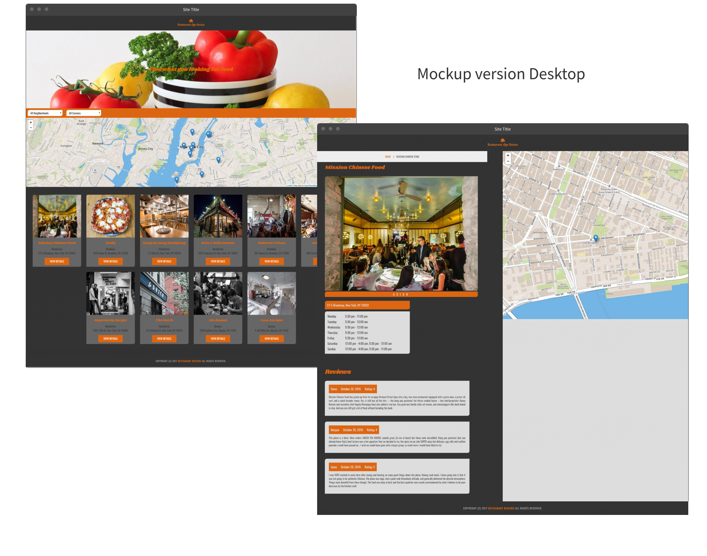
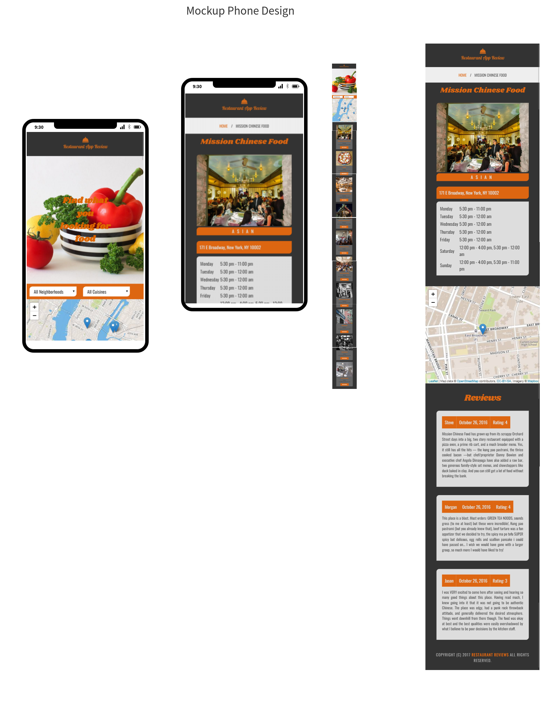

# Front-End Nanodegree Udacity- Restaurant App Review (stage 1)

In this stage (1), the goal is incrementally to convert a static webpage to a mobile-ready web application, and convert to be responsive on different sized displays, and accessible for screen reader use, add a service worker, to creating a seamless offline experience for users.

## Instructions

You can visit the page here: 

<a href="https://catveiga.github.io/Restaurant-App-Review/restaurant.html?id=9">Restaurant-App-Review</a>

### Locally 

1. Download this repo;
2. Unzipped the file and clone;
3. In this folder, start up a simple HTTP server to serve up the site files on your local computer. Python has some simple tools to do this, and you don't even need to know Python. For most people, it's already installed on your computer. 

### Python Setup
If you don't have Python installed, navigate to Python's [website](https://www.python.org/) to download and install the software.

1. In a terminal, check the version of Python you have:

`python -V`

2. If you have Python 2.x, spin up the server with 

`python -m SimpleHTTPServer 8000` 

(or some other port, if port 8000 is already in use.) 

3. For Python 3.x, you can use 

`python3 -m http.server 8000`. 

If you don't have Python installed, navigate to Python's [website](https://www.python.org/) to download and install the software.

### Visit the site

1. With your server running, visit the site:

`http://localhost:8000`

 and look around for a bit to see what the current experience looks like.

2. Explore the provided code, and start making a plan to implement the required features in three areas: responsive design, accessibility and offline use.

3. Write code to implement the updates to get this site on its way to being a mobile-ready website.

## Leaflet.js and Mapbox:

This repository uses [leafletjs](https://leafletjs.com/) with [Mapbox](https://www.mapbox.com/). Mapbox is free to use, and does not require any payment information. 

## Responsiveness and Accessibility

For complete this project, and make it responsive I only use Flexbox, and media queries. I try to implement ARIA semantic, much as I can on the HTML files. In Audits test, the website has 90% of accessibility;

Take a look at the video: 

* <a href="https://www.youtube.com/watch?v=Ay9otqOgrbU&feature=youtu.be">trailer</a>

### Original Repository 
* <a href="https://github.com/udacity/mws-restaurant-stage-1">mws-restaurant-stage-1</a>

## Authors

* <a href="https://github.com/cveiga819">Catarina Veiga</a>

